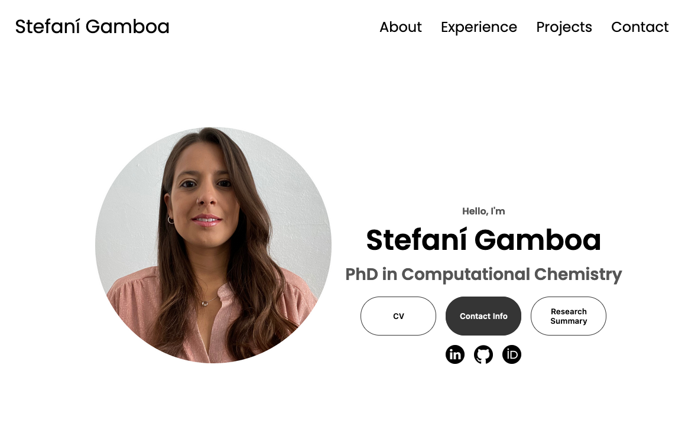

# Responsive Profile using HTML & CSS

Welcome to my responsive profile. This project showcases my web development skills with a clean and responsive design. If you're curious about the design, coding practices, or just wish to get an idea for your project, feel free to explore!

## Preview

[Live Demo](https://stefani-gamboa-portfolio.netlify.app/)

## Features

- **Responsive Design**: Adapts well to various screen sizes, from mobile devices to desktops.
- **Clean & Readable Code**: Commented and structured for easy understanding and future modifications.
- **Modern Aesthetics**: Sleek and intuitive design for an appealing user experience.

## Technologies Used

- HTML5
- CSS3

## Credits

Credit to their original project can be found [here](https://github.com/Ade-mir).
